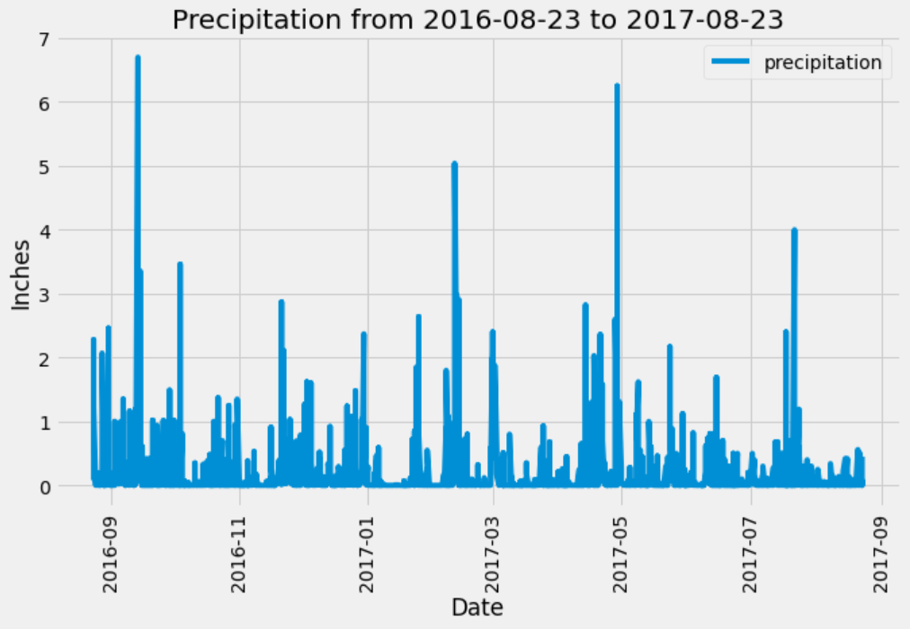
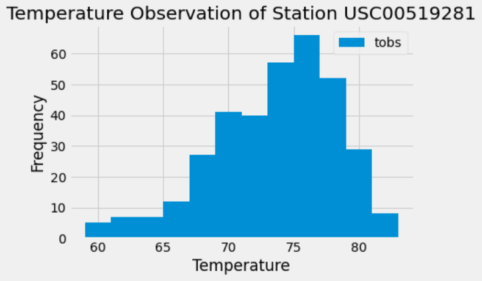
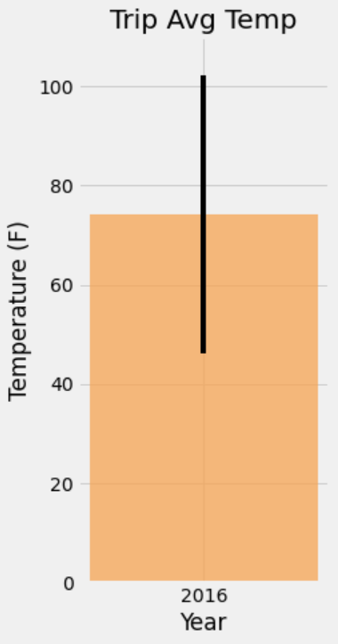

# Advanced Data Storage & Retrieval with SQLAlchemy & Flask  

I've decided to treat myself to a long holiday vacation in Honolulu, Hawaii! To help with my trip planning, I needed to do some climate analysis on the area. 

## Step 1 - Climate Analysis and Exploration

Using Python and SQLAlchemy, I did basic climate analysis and data exploration of the climate database. All of the following analysis was be completed using SQLAlchemy ORM queries, Pandas, and Matplotlib.

* Completed the climate analysis and data exploration, using [Climate Notebook](climate.ipynb) and [hawaii.sqlite](Resources/hawaii.sqlite) files.

* Used SQLAlchemy `create_engine` to connect to your sqlite database.

* Used SQLAlchemy `automap_base()` to reflect your tables into classes and save a reference to those classes called `Station` and `Measurement`.

* Linked Python to the database by creating an SQLAlchemy session.

### Precipitation Analysis

* Started by finding the most recent date in the data set.

* Using this date, retrieved the last 12 months of precipitation data by querying the 12 preceding months of data. 

* Selected only the `date` and `prcp` values.

* Loaded the query results into a Pandas DataFrame and set the index to the date column.

* Sorted the DataFrame values by `date`.

* Plotted the results using the DataFrame `plot` method.

* Used Pandas to print the summary statistics for the precipitation data.

### Station Analysis

* Designed a query to calculate the total number of stations in the dataset.

* Designed a query to find the most active stations (i.e. which stations have the most rows?).

  * Listed the stations and observation counts in descending order.

  * Found which station id has the highest number of observations.

  * Using the most active station id, calculated the lowest, highest, and average temperature.

  * Used functions such as `func.min`, `func.max`, `func.avg`, and `func.count` in my queries.

* Designed a query to retrieve the last 12 months of temperature observation data (TOBS).

  * Filtered by the station with the highest number of observations.

  * Queried the last 12 months of temperature observation data for this station.

  * Plotted the results as a histogram with `bins=12`.

  

* Closed out my session. 

- - -

## Step 2 - Climate App

Now that the initial analysis is completed, I designed a Flask API based on the queries that I have just developed.

* Used Flask to create your routes.

### Routes

* `/`

  * Home page.

  * Listed all routes that are available.

* `/api/v1.0/precipitation`

  * Converted the query results to a dictionary using `date` as the key and `prcp` as the value.

  * Returned the JSON representation of my dictionary.

* `/api/v1.0/stations`

  * Returned a JSON list of stations from the dataset.

* `/api/v1.0/tobs`
  * Queried the dates and temperature observations of the most active station for the last year of data.

  * Returned a JSON list of temperature observations (TOBS) for the previous year.

* `/api/v1.0/<start>` and `/api/v1.0/<start>/<end>`

  * Returned a JSON list of the minimum temperature, the average temperature, and the max temperature for a given start or start-end range.

  * When given the start only, calculated `TMIN`, `TAVG`, and `TMAX` for all dates greater than and equal to the start date.

  * When given the start and the end date, calculated the `TMIN`, `TAVG`, and `TMAX` for dates between the start and end date inclusive.

- - -

## Other Analyses

### Temperature Analysis I

* Hawaii is reputed to enjoy mild weather all year. Is there a meaningful difference between the temperature in, for example, June and December?

* Used pandas to perform this, see my [Temperature Analysis I](temp_analysis_part_1.ipynb).

  * Converted the date column format from string to datetime.

  * Set the date column as the DataFrame index.

  * Dropped the date column.

* Identified the average temperature in June at all stations across all available years in the dataset. Did the same for December temperature.

* Used the t-test to determine whether the difference in the means, if any, is statistically significant.

### Temperature Analysis II

* I was looking to take a trip from August 1st to August 7th of this year, but was worried that the weather would be less than ideal. Using historical data in the dataset I found out what the temperature has previously looked like.

* The [Temperature Analysis II](temp_analysis_bonus_part_2.ipynb) contains a function called `calc_temps` that accepts a start date and end date in the format `%Y-%m-%d`. The function returns the minimum, average, and maximum temperatures for that range of dates.

* Used the `calc_temps` function to calculate the min, avg, and max temperatures for my trip using the matching dates from a previous year (i.e., use "2017-08-01").

* Plotted the min, avg, and max temperature from my previous query as a bar chart.

  * Used "Trip Avg Temp" as the title.

  * Used the average temperature as the bar height (y value).

  * Used the peak-to-peak (TMAX-TMIN) value as the y error bar (YERR).

  

### Daily Rainfall Average

* Now that I have an idea of the temperature, let's check to see what the rainfall has been, I wouldn't want it to rain the whole time!

* Calculated the rainfall per weather station using the previous year's matching dates.

  * Sorted this in descending order by precipitation amount and list the station, name, latitude, longitude, and elevation.

### Daily Temperature Normals

* Calculated the daily normals for the duration of my trip. Normals were the averages for the min, avg, and max temperatures. Function called `daily_normals` calculates the daily normals for a specific date. This date string is in the format `%m-%d`. Used all historic TOBS that match that date string.

  * Set the start and end date of the trip.

  * Used the date to create a range of dates.

  * Stripped off the year and save a list of strings in the format `%m-%d`.

  * Used the `daily_normals` function to calculate the normals for each date string and appended the results to a list called `normals`.

* Loaded the list of daily normals into a Pandas DataFrame and set the index equal to the date.

* Used Pandas to plot an area plot (`stacked=False`) for the daily normals.

* Closed out my session.

- - -

## References

Menne, M.J., I. Durre, R.S. Vose, B.E. Gleason, and T.G. Houston, 2012: An overview of the Global Historical Climatology Network-Daily Database. Journal of Atmospheric and Oceanic Technology, 29, 897-910, [https://doi.org/10.1175/JTECH-D-11-00103.1](https://doi.org/10.1175/JTECH-D-11-00103.1)
